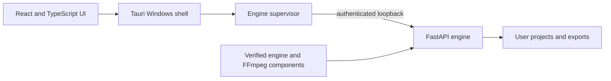

# AI Video Editor Desktop V2

A Windows desktop application for lecturer-supervised editing of educational videos. The interface uses React and TypeScript inside a Tauri shell; a separately managed FastAPI engine handles project workflows, media processing, and exports.

**Current source checkpoint:** `2.0.0-rc.6` (installer recovery work, September 2026). This is a development release candidate, not a production-ready release. The current source still needs clean-machine validation and production release signing evidence. See [RC6 release provenance and gates](docs/desktop-v2/RC6_RELEASE_PROVENANCE.md).

## What it does

- Creates video projects and imports lecture media and course materials.
- Guides a lecturer through source checks, processing, transcript review, edit decisions, and export.
- Uses a local engine process with authenticated loopback communication between the Tauri shell and backend.
- Manages separately packaged engine and FFmpeg components, including integrity checks, staging, activation, repair, and rollback state.
- Preserves user projects and exports during ordinary uninstall; full data removal is a separate explicit operation.

## Project status

| Area | Current state |
|---|---|
| Source version | `2.0.0-rc.6` |
| Latest recorded work | Installer interruption and recovery hardening |
| Automated checks | Windows CI is being established; no CI result is claimed yet |
| Clean-machine install proof | Still required for the current RC6 source |
| Production signing | Release signing material was not present in the source environment |
| Production release | Not ready |

RC6 is documented as a source checkpoint with release gates. The presence of installer, component-signing, and recovery code does not mean a production installer has passed those gates. See [RC6 release provenance](docs/desktop-v2/RC6_RELEASE_PROVENANCE.md), [historical RC3 clean Windows validation notes](docs/desktop-v2/CLEAN_WINDOWS_VALIDATION_RC3.md), and [architecture and operations](docs/desktop-v2/FINAL_ARCHITECTURE_AND_OPERATIONS.md).

## Architecture



The shell is installed under `%ProgramFiles%\AI Video Editor Desktop V2`. Machine-managed components and activation state live under `%ProgramData%\AI Video Editor`. Per-user settings live under `%LocalAppData%\AI Video Editor`; projects and exports live under `%USERPROFILE%\Documents\AI Video Editor`. The exact RC6 data and uninstall behavior is described in the [operations guide](docs/desktop-v2/FINAL_ARCHITECTURE_AND_OPERATIONS.md).

## Repository contents

| Path | Contents |
|---|---|
| `desktop/` | React application, Tauri shell, installer configuration, and frontend build |
| `backend/` | FastAPI engine and backend tests |
| `contracts/` | Versioned contracts and release provenance fixtures |
| `scripts/desktop-v2/` | Installer, packaging, validation, and release support scripts |
| `docs/desktop-v2/` | Phase, architecture, operations, security, and release evidence |
| `fixtures/` | Synthetic fixtures used by selected checks |

The Git history preserves the earlier FYP code lineage and the Desktop V2 development stages. Existing Phase and RC refs are intended as historical milestones; use pull requests for new changes.

## Build and development

The native application targets Windows. A development machine needs Node.js, Rust, the Windows C++ build tools required by Tauri, and Python dependencies for backend work. Provider-backed features may also need locally configured credentials.

```powershell
Copy-Item .env.example .env
npm ci --prefix desktop
npm run build --prefix desktop
```

To run the frontend during development:

```powershell
npm run dev --prefix desktop
```

To start the Tauri shell from the `desktop` directory:

```powershell
npx tauri dev
```

The shell's backend supervisor and the desktop Compose configuration have launcher-managed environment requirements. For service topology and data paths, read [architecture and operations](docs/desktop-v2/FINAL_ARCHITECTURE_AND_OPERATIONS.md) and the checked-in Compose files before starting the full desktop stack.

## Checks

The repository CI workflow targets Windows and runs the desktop contract/installer checks, the React/TypeScript build, Rust formatting and checks, and the backend unit suite.

Run the desktop checks locally from PowerShell:

```powershell
npm ci --prefix desktop
npm test --prefix desktop
npm run build --prefix desktop
cargo fmt --all --check --manifest-path desktop/src-tauri/Cargo.toml
cargo check --locked --manifest-path desktop/src-tauri/Cargo.toml
cargo test --locked --manifest-path desktop/src-tauri/Cargo.toml
```

Run backend tests after installing `backend/requirements.txt`:

```powershell
python -m unittest discover -s backend/tests -p "test_*.py"
```

CI checks do not replace the documented clean-machine installer, signed-component, recovery, or release handoff gates.

## Release and data safety

Production installer publishing remains gated. Do not place `.env` values, signing seeds, certificates, lecturer recordings, course materials, local databases, generated media, installers, or release handoffs in Git. Generated outputs and upload folders are ignored by `.gitignore`.

See [RC6 lecturer use](docs/desktop-v2/RC6_LECTURER_USE.md), [troubleshooting](docs/desktop-v2/RC6_LECTURER_TROUBLESHOOTING.md), and [release provenance](docs/desktop-v2/RC6_RELEASE_PROVENANCE.md).