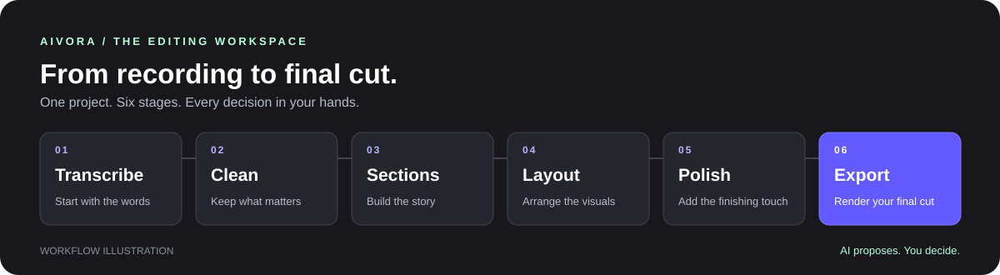

<p align="center">
  
</p>

<p align="center">
  <strong>Your footage. Your story. Your final cut.</strong><br />
  AI-assisted video editing for lessons, tutorials, and presentations.<br />
  Work from a transcript. Review every suggestion. Export on your terms.
</p>

<p align="center">
  
  
  <a href="https://github.com/desanv01/ai-video-editor-desktop-v2/actions/workflows/ci.yml"></a>
  <a href="LICENSE"></a>
</p>

<p align="center">
  <a href="#features">Features</a> ·
  <a href="#get-started">Get started</a> ·
  <a href="docs/README.md">Documentation</a> ·
  <a href="https://github.com/desanv01/ai-video-editor-desktop-v2/issues">Feedback</a>
</p>

<p align="center">
  
  <br /><sub>AI proposes. You decide. Aivora renders the approved plan.</sub>
</p>

## Features

### Edit from the words

Review timestamped speech, correct the transcript, and select text to cut. Keep or override AI suggestions before they become final edits. Download the original transcript as plain TXT, timestamped TXT, JSON, or segment CSV, independently of the final video.

### Bring the whole recording together

Import video, screen recordings, camera footage, audio, slides, and reference documents into a project. Use supporting materials to help the processing pipeline understand the content and propose relevant visuals.

### Shape a clear story

Review proposed cuts, content sections, and chapter order. The six-stage workspace takes you through **Transcribe → Clean → Sections → Layout → Polish → Export**, with manual decisions saved alongside the plan.

### Put the right visual on screen

Review slide matches and choose fullscreen, side-by-side, or picture-in-picture layouts. Adjust captions, annotations, title cards, and other finishing elements before rendering.

### Export with a record of your decisions

Render approved edits through managed FFmpeg. Save video, audio, captions, chapters, plans, quality reports, and editing evidence. Original transcript downloads retain source content even when speech is removed from the final cut.

### A workspace on your machine

The Windows app manages its private engine and media tools, verifies component archives before activation, and stores projects locally. SQLite holds project state; LanceDB supports content retrieval. Configure your own provider credentials for hosted AI features, or use supported local transcription routes when their runtime and model are prepared.

---

## Get started

**Current source version: `2.1.0-rebuild.2`.** Aivora is an engineering preview for Windows x64. The current app uses Electron; the older Tauri shell remains in source for compatibility checks. Release signing, installed end-to-end workflow acceptance, other-machine validation, and live provider/GPU results require separate release evidence.

### Windows application

Check [Releases](https://github.com/desanv01/ai-video-editor-desktop-v2/releases) for available handoffs and their stated validation. A usable handoff needs the matching installer, component manifest, and runtime archives. CI installer artifacts alone do not include the full runtime. Follow the [setup guide](docs/getting-started.md) and the instructions shipped with the handoff.

The managed app is designed to run without system Python, Node.js, Docker, or FFmpeg. Required components must finish verification and preparation before the editor opens. Hosted processing needs your chosen provider's credentials and connectivity; local project storage does not imply that every AI feature works offline.

### Build from source

Use Windows x64, **Node.js `24.14.1`**, npm, and **Python 3.12** for backend development. Node's exact version is declared in the desktop package and used by CI.

```powershell
git clone https://github.com/desanv01/ai-video-editor-desktop-v2.git
Set-Location ai-video-editor-desktop-v2
npm ci --prefix desktop
npm run build --prefix desktop
npm run dev:electron --prefix desktop
```

The native shell loads the built interface. It needs the matching managed component set to run processing. For frontend iteration, `npm run dev --prefix desktop` starts Vite on port 1420; browser mode requires a separately configured API and does not launch the managed engine.

[Development and checks →](CONTRIBUTING.md)

---

## Built with

| Desktop | Engine | Data | Managed tools |
| --- | --- | --- | --- |
| Electron · React 19 · TypeScript · Tailwind | Packaged FastAPI · Python 3.12 | SQLite · LanceDB · local files | FFmpeg/FFprobe · LibreOffice · whisper.cpp + model |

The shell supervises the engine through authenticated loopback communication. Component preparation checks archive size, SHA-256, safe extraction, and probes before activation. [Architecture →](docs/architecture.md)

## Documentation

- [Install, prepare components, and configure providers](docs/getting-started.md)
- [Architecture and repository map](docs/architecture.md)
- [Transcript downloads and editing evidence](docs/exports.md)
- [Development and contribution guide](CONTRIBUTING.md)
- [Engineering contracts and release gates](docs/rebuild/CONTRACTS.md)

## Feedback & contributions

Found a bug or have a feature in mind? [Open an issue](https://github.com/desanv01/ai-video-editor-desktop-v2/issues). Include your app version, workflow, expected result, and reproduction steps. Use synthetic or permission-cleared samples and remove credentials and private media from public reports.

Want to contribute? Start with [CONTRIBUTING.md](CONTRIBUTING.md). [Star the repo](https://github.com/desanv01/ai-video-editor-desktop-v2) to follow development.

## License

Aivora is distributed under the [GNU Affero General Public License, version 3](LICENSE). Component distributions carry their own third-party notices and applicable licenses; see the `NOTICE.txt` supplied with a handoff.
