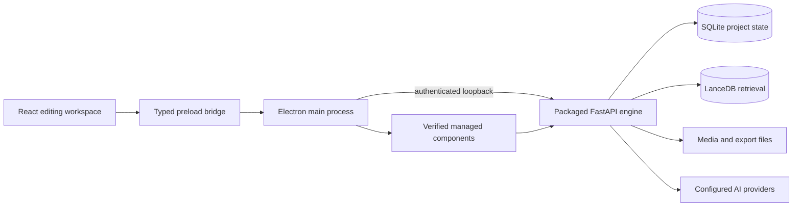

# Aivora architecture

The current application uses Electron with a React editing workspace and a packaged FastAPI engine. Projects remain local, and AI suggestions become a reviewable plan before rendering.

## Runtime

| Layer | Current implementation |
| --- | --- |
| Interface | React 19, TypeScript, Vite, Tailwind, six editing stages |
| Shell | Electron 44.5.1; sandboxed renderer, context isolation, typed preload |
| Engine | Python 3.12/FastAPI, separate supervised process |
| Storage | SQLite project state and durable jobs; LanceDB vectors |
| Media | Managed FFmpeg/FFprobe; LibreOffice document conversion |
| Transcription | Hosted adapters and prepared whisper.cpp runtime/model |
| Credentials | Main-process encrypted storage and private engine-session synchronization |
| Setup | Versioned component manifest, size/hash checks, confined extraction, probes, activation and recovery |

The five processing agents retain their content, fluency, section, visual, and planning responsibilities. The editor exposes Transcribe, Clean, Sections, Layout, Polish, and Export. Approval and manual overrides remain part of the workflow.

## Repository map

| Path | Purpose |
| --- | --- |
| `desktop/src/` | Editing interface and native bridge integration |
| `desktop/electron/` | Main/preload processes, setup, credentials, engine supervision |
| `desktop/electron-builder.yml` | Current Windows installer configuration |
| `backend/app/` | API, agents, providers, processing, retrieval, rendering |
| `backend/app/desktop_native/` | Native startup, storage, jobs, private session integration |
| `backend/tests/` | Backend regression tests |
| `contracts/rebuild/` | Current runtime and component contracts |
| `scripts/rebuild/` | Packaging and focused runtime checks |
| `fixtures/` | Synthetic media and component fixtures |
| `docs/assets/` | Aivora vector brand assets |
| `.github/` | CI and issue/PR templates |

`desktop/src-tauri/`, `contracts/desktop-v2/`, `scripts/desktop-v2/`, and `docs/desktop-v2/` retain the older Tauri implementation and checks. They are not the current Electron installation route. Internal `AIVE` storage names, environment variables, schemas, and component IDs remain stable for compatibility.

## Release boundaries

The current manifest is backed by exact archive inventories; those archives must accompany a usable handoff. CI builds and checks the shell and backend, but does not establish live-provider, GPU, other-laptop, signing, or installed six-stage acceptance. Consult [runtime contracts](rebuild/CONTRACTS.md) and the release's actual qualification before distribution.
