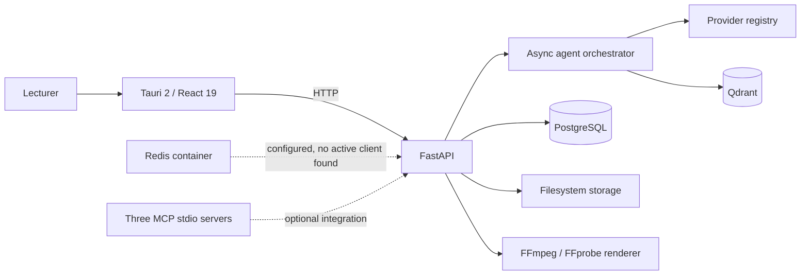
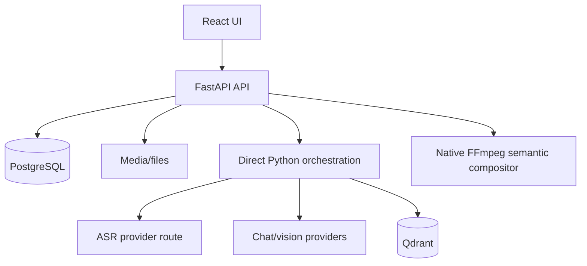
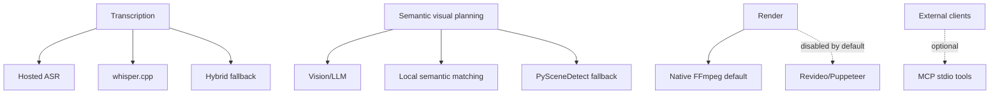

# System Architecture

The Tauri shell launches a React client and, for packaged desktop use, bootstraps a Docker Compose backend on loopback port 18000. Browser development defaults to port 8000. FastAPI coordinates direct asynchronous Python agents, PostgreSQL, Qdrant, providers, document extraction, and rendering. Media and generated artifacts remain on the filesystem; paths and structured state are persisted in PostgreSQL.

## Active runtime only

## Optional and fallback paths

| Component | Purpose | Active/optional | Entry point | Dependencies | Evidence |
|---|---|---|---|---|---|
| Tauri shell | Desktop bootstrap/storage/native import | Active desktop | `desktop/src-tauri/src/main.rs` | Docker Desktop, WebView | `desktop/src-tauri/src/lib.rs:218-768` |
| React client | Lecturer workflow | Active | `desktop/src/main.tsx` | FastAPI | `desktop/src/App.tsx:25-213` |
| FastAPI | API/lifecycle | Active | `backend/app/main.py` | DB/Qdrant/storage | `backend/app/main.py:17-113` |
| Orchestrator | Five-stage pipeline | Active | `run_full_pipeline` | agents/providers | `backend/app/agents/orchestrator.py:96-200` |
| PostgreSQL | Relational state | Required | `backend/app/db/database.py` | SQLAlchemy/asyncpg | `backend/app/db/models.py:139-392` |
| Qdrant | RAG vectors | Required for RAG | `VectorStore` | embedding provider | `backend/app/rag/vector_store.py:52-64` |
| Redis | Provisioned cache/queue | CONFIGURATION_DEPENDENT | Compose only | Redis image | `docker-compose.yml:73-79` |
| Renderer | Final media/artifacts | Active | `render_final_video` | FFmpeg/FFprobe | `backend/app/services/renderer.py:471` |
| MCP | 25 external tools | Optional integration | `backend/app/mcp/run_mcp.py` | stdio client | `backend/app/mcp/*_server.py` |

n8n is DEPRECATED. LangGraph is IMPLEMENTED_BUT_NOT_CONNECTED as a dependency only. MCP is not required for the normal UI workflow.
