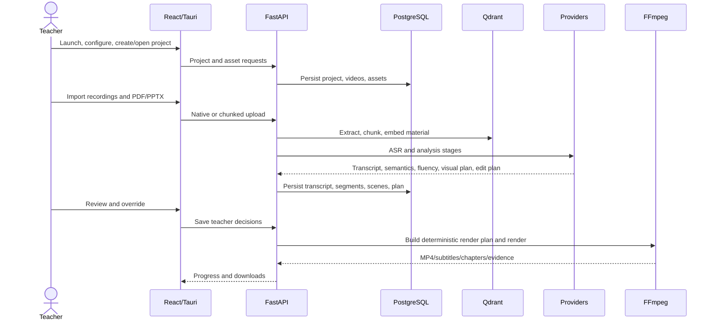

# End-to-End User and Data Workflow

| Step | User/frontend | API/backend | Persistence/artifacts | Failure/retry |
|---|---|---|---|---|
| Launch/settings | `App`, `MainSettingsPanel` | settings/model routes; desktop bootstrap | `AppAISettings`, encrypted keys when configured | Failed backend bootstrap surfaces fetch/bootstrap error |
| Create/open project | `ProjectDashboard` | project CRUD | `Project`; project types/source setup | Duplicate/title validation is server/UI dependent |
| Add video(s) | `UploadPanel` | upload, chunk, native import, source-sync routes | `Video`, file paths, import session state | offset conflict, disk-space and orphan/quarantine handling |
| Add materials | multi-source upload | project assets and course-material extraction | `ProjectAsset`, `CourseMaterial`, page metadata, vectors | unsupported/empty extraction; scanned PDF OCR absent |
| Transcribe | processing view | `run_transcription_agent` | `Transcript`, `Segment` | provider retry/fallback and long-audio chunking |
| Analyse | guided workflow | Agents 2-5; Agents 3/4 parallel | segment analysis, scenes, edit plan | deterministic fallback and warning paths |
| Review | transcript/timeline/layout controls | segment, cue and plan update routes | teacher action/note/modified flags | warnings remain reviewable; regeneration can replace automatic data |
| Render/export | Export stage | approval creates persistent render job | MP4/M4A, SRT/VTT, chapters, plan, evidence | polling/cancel/restart interruption detection, FFmpeg watchdog |
| Reopen | dashboard/project load | project detail/status routes | relational/file state restored | missing backend, paths or containers cause partial load |

Disconnected/incomplete areas: local desktop project-file commands are not the primary React project persistence path; Redis has no traced runtime consumer; MCP is external-only; raw desktop Compose cannot start without launcher environment; browser and desktop can point at different databases and therefore show different projects.
