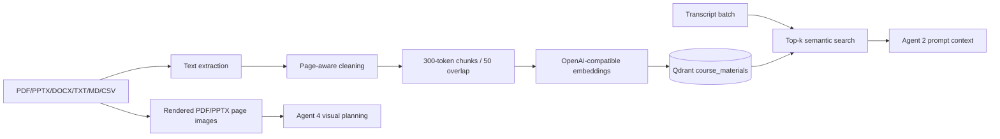

# RAG and Course Material Pipeline

| Parameter | Current value | Evidence |
|---|---|---|
| Collection | `course_materials` | `backend/app/config.py`; `backend/app/rag/vector_store.py:52-64` |
| Embedding | `text-embedding-3-small`, 1536 dimensions | `backend/app/config.py` |
| Chunking | 300 tokens, overlap 50 | `backend/app/config.py` |
| Search | top-k 5, threshold 0.0 default | `backend/app/rag/vector_store.py:422-463` |
| Distance | Cosine | `backend/app/rag/vector_store.py:52-64` |
| Retry | one ingest retry after 2 seconds | `backend/app/rag/vector_store.py:112-130` |

PDF extraction uses PyMuPDF text; PPTX extraction includes shapes, tables, and speaker notes (`backend/app/services/text_extraction.py`). PDF/PPTX pages can also be rendered to images for Agent 4 (`pdf_slides.py`, `pptx_slides.py`). Project assets preserve optional one-based page ranges. Qdrant payloads retain source/page/file metadata.

Important limitations: no reranker was found; threshold 0.0 can admit weak matches; no content-hash deduplication was found; scanned PDFs have no implemented OCR despite an OCR-oriented comment/docstring; deletion removes vectors/files/rows but retention guarantees are not authenticated; Agent 2 uses retrieved text while Agent 4 primarily uses rendered page data and semantic prompts.
