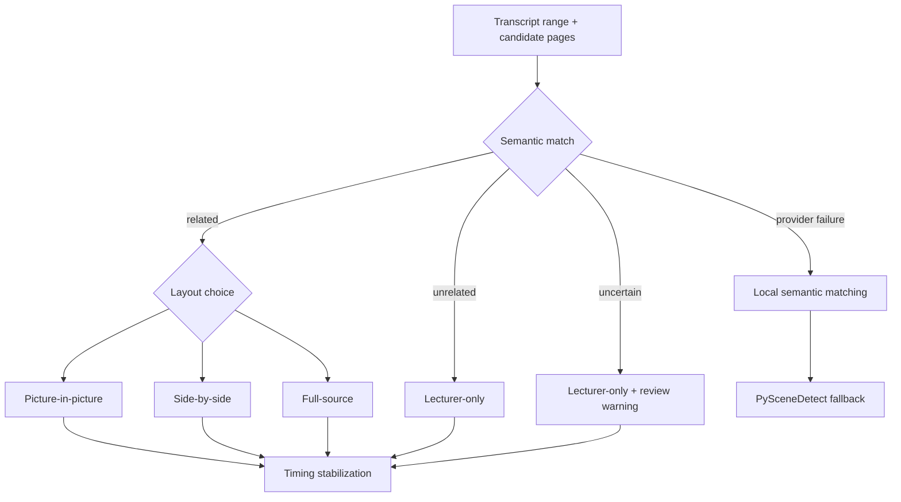

# Semantic Visual Planning

Agent 4 builds page candidates from the selected project visual asset, respects a manual page scope when present, renders pages, aligns transcript windows, and asks the configured semantic/vision path for page and layout decisions. The exact labels `related`, `unrelated`, and `uncertain` are normalized in code. Unrelated and uncertain automatic decisions suppress the slide and use lecturer-only output; uncertain decisions carry `review_required`. Related decisions may use picture-in-picture by default, side-by-side selectively, or full-source sparingly (`backend/app/agents/visual_structure.py:468-481,1033-1058`; `backend/app/services/editorial_plan.py:283-297`).

```text
for each transcript window:
    restrict candidate pages to teacher scope when supplied
    obtain semantic page/relation/layout result
    normalize page index, confidence, relation and timing
    if relation == unrelated: use full_camera_source
    elif relation == uncertain: use full_camera_source and require review
    else: retain matched page and selected supported layout
stabilize adjacent/short cues to avoid visual flicker
persist scene/layout metadata and build deterministic render plan
on semantic failure: local matching, then PySceneDetect fallback where applicable
```



| Case | Slide | Layout | Review |
|---|---|---|---|
| related/high confidence | selected page | PIP/side/full source | optional |
| related/low diagnostic score | preserved | supported layout | may warn |
| unrelated | none | lecturer-only | no forced visual |
| uncertain | none by safe default | lecturer-only | required |
| speech absent from slides | none | lecturer-only | inspect if uncertain |
| provider failure | local/fallback result | conservative | warning |

Short/uncertain cue stabilization is implemented around `backend/app/agents/visual_structure.py:1297-1322`. PySceneDetect is a fallback around `:1532`, not the primary semantic planner. Weaknesses include provider-dependent diagram understanding, no measured page-selection accuracy, local lexical fallback limitations, possible page-number extraction ambiguity, and no proof yet across the five-video study.
