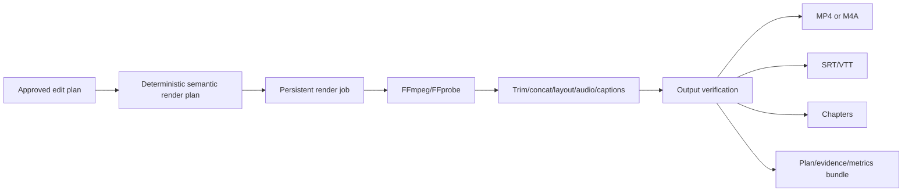

# Rendering, Export, and Media Processing



`render_final_video` is the principal entry point (`backend/app/services/renderer.py:471`). Simple edits may use fast trim/concatenate paths; semantic layouts use the native FFmpeg compositor by default. Revideo/Puppeteer is optional and disabled by default. FFprobe validates source/output metadata. Hardware encoder selection can consider NVENC, QSV, VAAPI, or AMF; configuration controls CPU fallback.

| Artifact | Format | Status |
|---|---|---|
| edited lecture | MP4 or preset-specific M4A | IMPLEMENTED_AND_CONNECTED |
| subtitles | SRT and VTT; burn-in path also exists | IMPLEMENTED_AND_CONNECTED |
| chapters | structured chapter export | IMPLEMENTED_AND_CONNECTED |
| edit/render plan | JSON | IMPLEMENTED_AND_CONNECTED |
| academic evidence | JSON and Markdown | IMPLEMENTED_AND_CONNECTED |
| timeline/provider/metric evidence | CSV/JSON bundle | IMPLEMENTED_AND_CONNECTED |

Sanitised illustrative command shape, not a captured literal invocation:

```text
ffmpeg -i <project-video> -filter_complex "<scale/crop/overlay/concat graph>" -map <video> -map <audio> -c:v <selected-encoder> -c:a aac <project-output.mp4>
```

Progress and cancellation are persisted by `render_jobs.py`; interrupted jobs are detected on restart and duplicate active claims are rejected. The native compositor has a no-progress watchdog. Temporary cleanup exists, but hard termination can leave artifacts. Risks include variable-frame-rate timing, source/audio drift, unsupported codecs, missing fonts, hardware encoder availability, malformed source timestamps, and long-render resource pressure. Full-source, camera-full, PIP, side-by-side, captions, annotations, and multiple export presets are represented; empirical 40+ minute reliability remains UNVERIFIED.

## Post-audit render regression and fix on 2026-06-16

A real localhost regression was reproduced on project `test23` with one 29:54 primary video, one 36-page PDF structure-reference asset, and 45 slide/layout cues. The render failed at 12 percent during `_generated_slide_background_asset`, which calls `create_slideshow_clip` for rasterized page images (`backend/app/services/renderer.py:1239-1310`). The UI and stored DB message showed an apparent NVENC failure, but the actionable FFmpeg tail revealed a filter-graph resource failure instead:

```text
Parsed_scale_63: Failed to configure output pad
Resource temporarily unavailable
Conversion failed
```

Root cause: the previous slideshow builder fed every slide page to FFmpeg as its own input and built one scale/fps chain per page before concatenation. With 36 simultaneous page inputs, the generated graph exhausted FFmpeg filter-thread resources before the encoder received a frame. This is why the previous four videos rendered successfully: their decks stayed below the complexity threshold where the slideshow filter graph became unstable.

The fix was applied in `backend/app/services/ffmpeg.py`:

- `FFmpegService.create_slideshow_clip` now uses an FFconcat manifest for multi-page slide decks, so the same timed page sequence is supplied through one video stream instead of dozens of parallel inputs (`backend/app/services/ffmpeg.py:1621-1706`).
- Single-image slideshow behavior was preserved.
- Temporary `.ffconcat` manifests are cleaned up after rendering (`backend/app/services/ffmpeg.py:1704-1706`).
- FFmpeg stderr handling now preserves the useful tail of the error output rather than truncating to the version banner (`backend/app/services/ffmpeg.py:24-28,64-112`).

Verification:

- A short probe using the real 36 rasterized `test23` slide pages failed with the old multi-input shape and reproduced the `Parsed_scale_63` / `Resource temporarily unavailable` error.
- The replacement FFconcat-based probe succeeded with the same 36 pages, using NVENC, and produced a valid 1920x1080 H.264/AAC slideshow.
- A live localhost retry of `test23` advanced past the previous 12 percent failure point into native semantic composition; as of the June 16, 2026 verification snapshot, the job had reached 23 percent with no error and was composing scene 12/90.

Implication for the report: this regression should be described as a render-pipeline implementation issue that was reproduced and fixed locally, not as a model or content-analysis failure.
