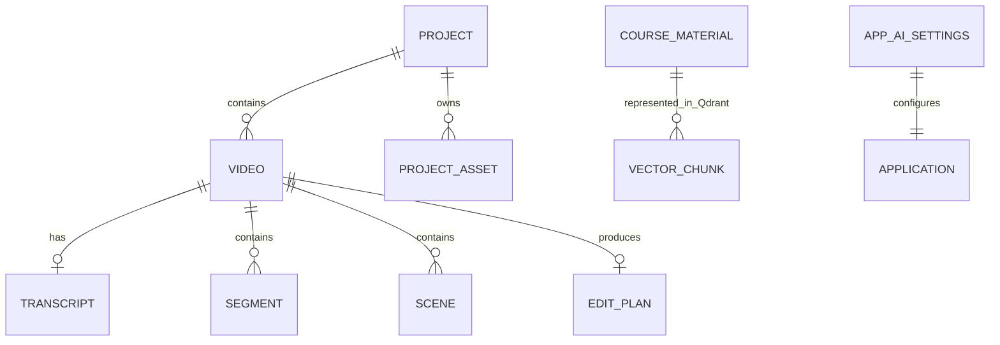

# Database and Persistence Model

| Entity | Fields | Relationships | Purpose | Current use | Evidence |
|---|---|---|---|---|---|
| Project | See ORM columns | SQLAlchemy relationships/foreign keys | Persist project pipeline state | IMPLEMENTED_AND_CONNECTED | `backend/app/db/models.py:139` |
| ProjectAsset | See ORM columns | SQLAlchemy relationships/foreign keys | Persist project pipeline state | IMPLEMENTED_AND_CONNECTED | `backend/app/db/models.py:159` |
| Video | See ORM columns | SQLAlchemy relationships/foreign keys | Persist project pipeline state | IMPLEMENTED_AND_CONNECTED | `backend/app/db/models.py:191` |
| Transcript | See ORM columns | SQLAlchemy relationships/foreign keys | Persist project pipeline state | IMPLEMENTED_AND_CONNECTED | `backend/app/db/models.py:223` |
| Segment | See ORM columns | SQLAlchemy relationships/foreign keys | Persist project pipeline state | IMPLEMENTED_AND_CONNECTED | `backend/app/db/models.py:252` |
| Scene | See ORM columns | SQLAlchemy relationships/foreign keys | Persist project pipeline state | IMPLEMENTED_AND_CONNECTED | `backend/app/db/models.py:303` |
| EditPlan | See ORM columns | SQLAlchemy relationships/foreign keys | Persist project pipeline state | IMPLEMENTED_AND_CONNECTED | `backend/app/db/models.py:321` |
| CourseMaterial | See ORM columns | SQLAlchemy relationships/foreign keys | Persist project pipeline state | IMPLEMENTED_AND_CONNECTED | `backend/app/db/models.py:353` |
| AppAISettings | See ORM columns | SQLAlchemy relationships/foreign keys | Persist project pipeline state | IMPLEMENTED_AND_CONNECTED | `backend/app/db/models.py:368` |

The nine-entity claim is confirmed by `backend/app/db/models.py:139-392`. Models use UUID-like identifiers, JSON fields for rich plans/metadata, timestamps/statuses, foreign keys, relationships, and cascades. Alembic revisions 001-005 cover initial state, app settings, project assets, project media sources, and large file-size conversion.

Persistence outside PostgreSQL includes Qdrant vectors, filesystem media/artifacts, `render_jobs.json` under configured state storage, desktop environment/settings files, and Tauri local project-file commands. No active Redis payload model was found. The Tauri `save_project`/`load_project` commands are IMPLEMENTED_BUT_NOT_CONNECTED to the primary backend project flow (`desktop/src-tauri/src/lib.rs:179-201`). Migration 005 is present in the dirty tree; deployment against older databases must run it before very large uploads. Frontend/backend type parity is broad but not mechanically generated, so drift remains a maintenance risk.
