# Figure Recreation Specifications

## Figure 1: Project-first teacher-supervised workflow

**Purpose:** Recreate project-first teacher-supervised workflow from verified implementation.
**Verified flow:** Project -> sources -> agents -> review -> render/export.
**Required labels:** active runtime components, database artifacts, optional/fallback paths as dashed lines, and teacher-review loops.
**Unverified element:** empirical performance/accuracy must not be embedded in the figure.
**Suggested caption:** "Project-first teacher-supervised workflow derived from the current implementation audit."
**Academic styling:** left-to-right or top-to-bottom flow, restrained colors, solid active edges, dashed optional edges, database cylinders, user actor distinct from software.

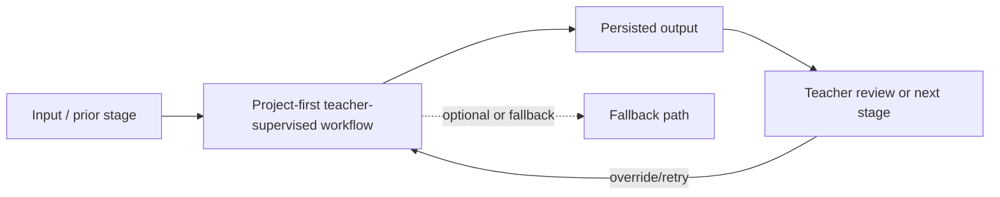

Specific note: Project and teacher review loop.

## Figure 2: Detailed multi-agent processing pipeline

**Purpose:** Recreate detailed multi-agent processing pipeline from verified implementation.
**Verified flow:** Agent 1 -> Agent 2 -> Agents 3/4 parallel -> Agent 5.
**Required labels:** active runtime components, database artifacts, optional/fallback paths as dashed lines, and teacher-review loops.
**Unverified element:** empirical performance/accuracy must not be embedded in the figure.
**Suggested caption:** "Detailed multi-agent processing pipeline derived from the current implementation audit."
**Academic styling:** left-to-right or top-to-bottom flow, restrained colors, solid active edges, dashed optional edges, database cylinders, user actor distinct from software.

Specific note: Specialised modules, not autonomous negotiation.

## Figure 3: Current three-tier system architecture

**Purpose:** Recreate current three-tier system architecture from verified implementation.
**Verified flow:** React/Tauri -> FastAPI -> persistence/providers/rendering.
**Required labels:** active runtime components, database artifacts, optional/fallback paths as dashed lines, and teacher-review loops.
**Unverified element:** empirical performance/accuracy must not be embedded in the figure.
**Suggested caption:** "Current three-tier system architecture derived from the current implementation audit."
**Academic styling:** left-to-right or top-to-bottom flow, restrained colors, solid active edges, dashed optional edges, database cylinders, user actor distinct from software.

Specific note: Redis/MCP shown as non-core.

## Figure 4: Five-agent execution and review pipeline

**Purpose:** Recreate five-agent execution and review pipeline from verified implementation.
**Verified flow:** Agent outputs -> deterministic checks -> teacher overrides.
**Required labels:** active runtime components, database artifacts, optional/fallback paths as dashed lines, and teacher-review loops.
**Unverified element:** empirical performance/accuracy must not be embedded in the figure.
**Suggested caption:** "Five-agent execution and review pipeline derived from the current implementation audit."
**Academic styling:** left-to-right or top-to-bottom flow, restrained colors, solid active edges, dashed optional edges, database cylinders, user actor distinct from software.

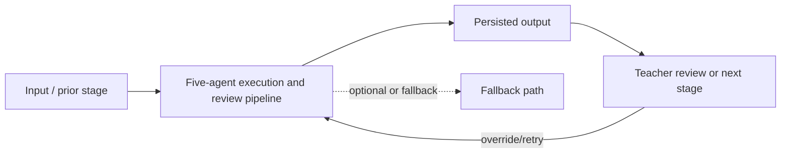

Specific note: Persisted review state.

## Figure 5: Current database/entity model

**Purpose:** Recreate current database/entity model from verified implementation.
**Verified flow:** Nine ORM entities and Qdrant/file side stores.
**Required labels:** active runtime components, database artifacts, optional/fallback paths as dashed lines, and teacher-review loops.
**Unverified element:** empirical performance/accuracy must not be embedded in the figure.
**Suggested caption:** "Current database/entity model derived from the current implementation audit."
**Academic styling:** left-to-right or top-to-bottom flow, restrained colors, solid active edges, dashed optional edges, database cylinders, user actor distinct from software.

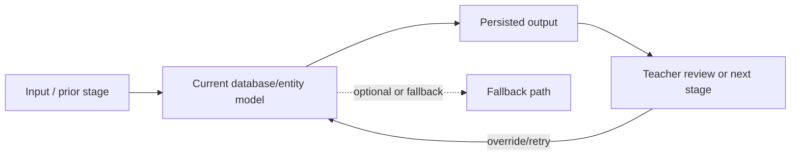

Specific note: Relational versus external persistence.

## Figure 6: Batch-level RAG analysis pipeline

**Purpose:** Recreate batch-level rag analysis pipeline from verified implementation.
**Verified flow:** Material chunks -> embeddings -> Qdrant -> Agent 2 batches.
**Required labels:** active runtime components, database artifacts, optional/fallback paths as dashed lines, and teacher-review loops.
**Unverified element:** empirical performance/accuracy must not be embedded in the figure.
**Suggested caption:** "Batch-level RAG analysis pipeline derived from the current implementation audit."
**Academic styling:** left-to-right or top-to-bottom flow, restrained colors, solid active edges, dashed optional edges, database cylinders, user actor distinct from software.

Specific note: top-k 5, no reranker.

## Figure 7: Semantic visual-planning and slide-relevance flow

**Purpose:** Recreate semantic visual-planning and slide-relevance flow from verified implementation.
**Verified flow:** related/unrelated/uncertain -> layout/review.
**Required labels:** active runtime components, database artifacts, optional/fallback paths as dashed lines, and teacher-review loops.
**Unverified element:** empirical performance/accuracy must not be embedded in the figure.
**Suggested caption:** "Semantic visual-planning and slide-relevance flow derived from the current implementation audit."
**Academic styling:** left-to-right or top-to-bottom flow, restrained colors, solid active edges, dashed optional edges, database cylinders, user actor distinct from software.

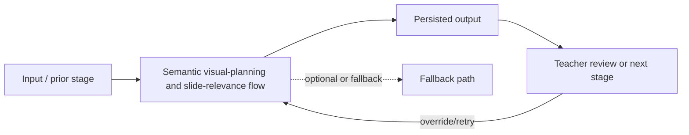

Specific note: safe lecturer-only fallback.

## Figure 8: Warning-based edit planning and teacher-override flow

**Purpose:** Recreate warning-based edit planning and teacher-override flow from verified implementation.
**Verified flow:** LLM actions -> validators -> warnings -> teacher.
**Required labels:** active runtime components, database artifacts, optional/fallback paths as dashed lines, and teacher-review loops.
**Unverified element:** empirical performance/accuracy must not be embedded in the figure.
**Suggested caption:** "Warning-based edit planning and teacher-override flow derived from the current implementation audit."
**Academic styling:** left-to-right or top-to-bottom flow, restrained colors, solid active edges, dashed optional edges, database cylinders, user actor distinct from software.

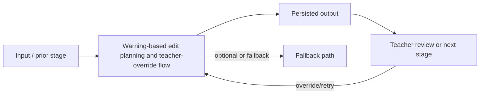

Specific note: manual precedence.

## Figure 9: Semantic rendering and evidence-export pipeline

**Purpose:** Recreate semantic rendering and evidence-export pipeline from verified implementation.
**Verified flow:** render plan -> FFmpeg -> verification -> artifacts.
**Required labels:** active runtime components, database artifacts, optional/fallback paths as dashed lines, and teacher-review loops.
**Unverified element:** empirical performance/accuracy must not be embedded in the figure.
**Suggested caption:** "Semantic rendering and evidence-export pipeline derived from the current implementation audit."
**Academic styling:** left-to-right or top-to-bottom flow, restrained colors, solid active edges, dashed optional edges, database cylinders, user actor distinct from software.

Specific note: native default, Revideo optional.

## Figure 10: Five-video manual-versus-agent evaluation protocol

**Purpose:** Recreate five-video manual-versus-agent evaluation protocol from verified implementation.
**Verified flow:** paired conditions -> separate timers -> descriptive comparison.
**Required labels:** active runtime components, database artifacts, optional/fallback paths as dashed lines, and teacher-review loops.
**Unverified element:** empirical performance/accuracy must not be embedded in the figure.
**Suggested caption:** "Five-video manual-versus-agent evaluation protocol derived from the current implementation audit."
**Academic styling:** left-to-right or top-to-bottom flow, restrained colors, solid active edges, dashed optional edges, database cylinders, user actor distinct from software.

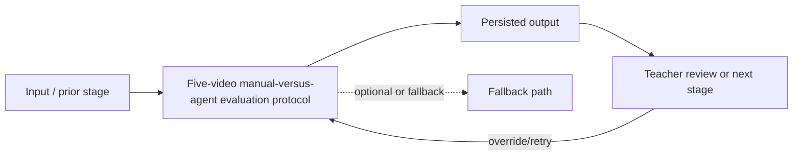

Specific note: no population inference.

## Verified Mermaid Set

Use these implementation-specific diagrams instead of the generic construction skeletons above.

### Figure 1 verified layout
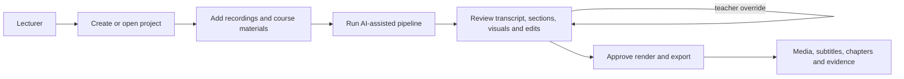

### Figure 2 verified layout
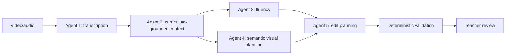

### Figure 3 verified layout
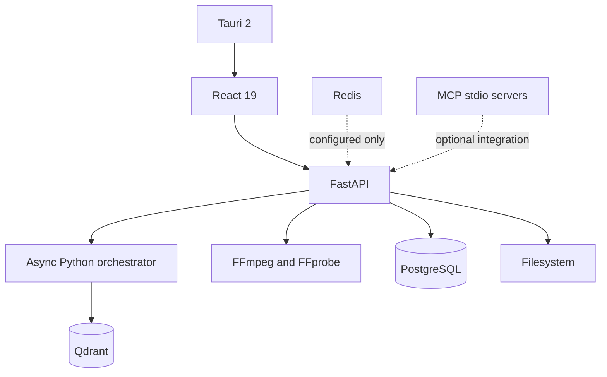

### Figure 4 verified layout
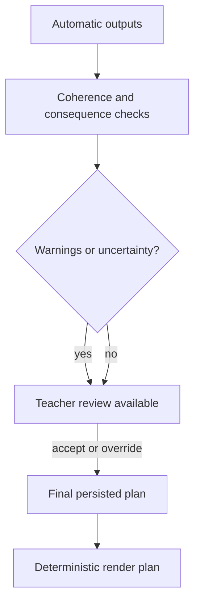

### Figure 5 verified layout
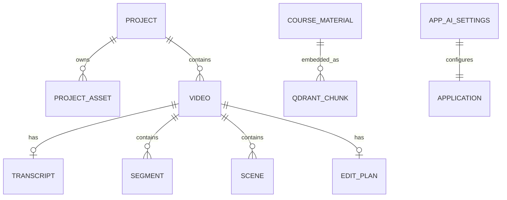

### Figure 6 verified layout
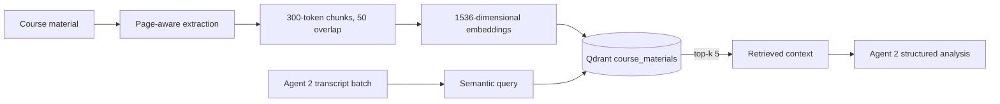

### Figure 7 verified layout
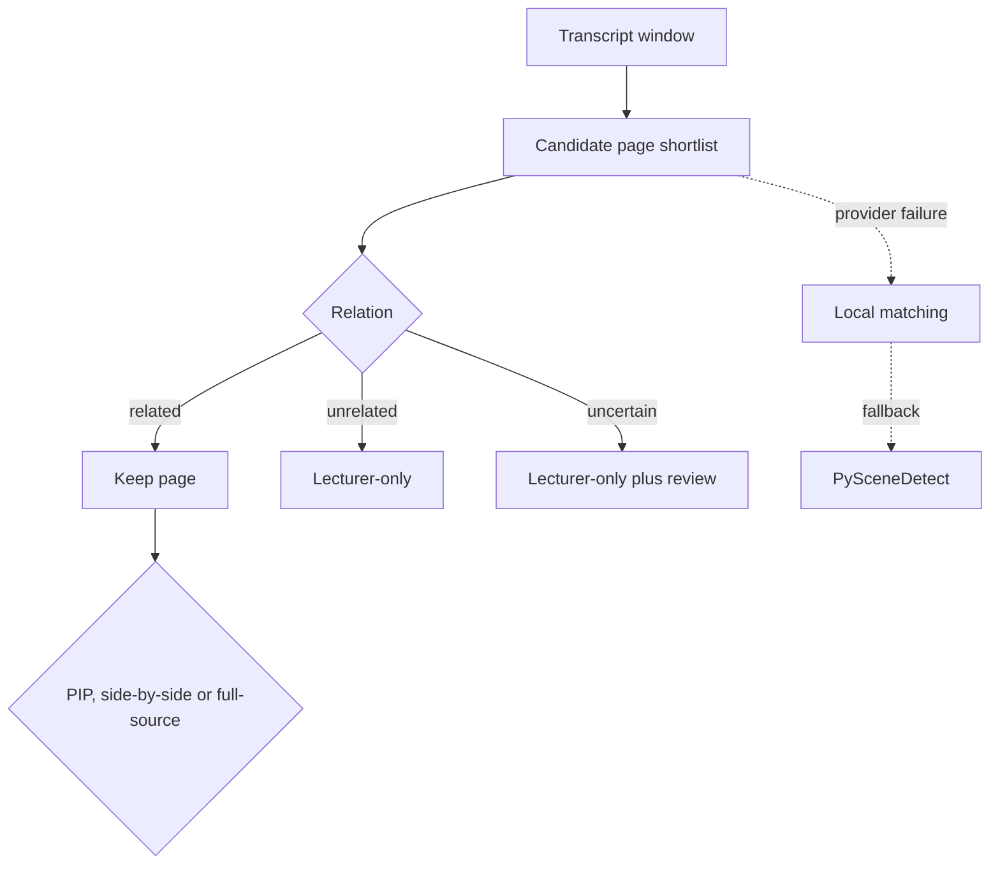

### Figure 8 verified layout
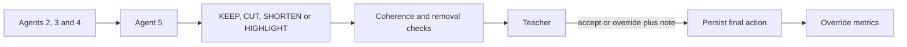

### Figure 9 verified layout
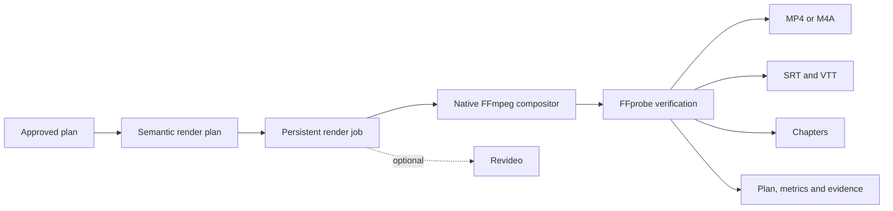

### Figure 10 verified layout
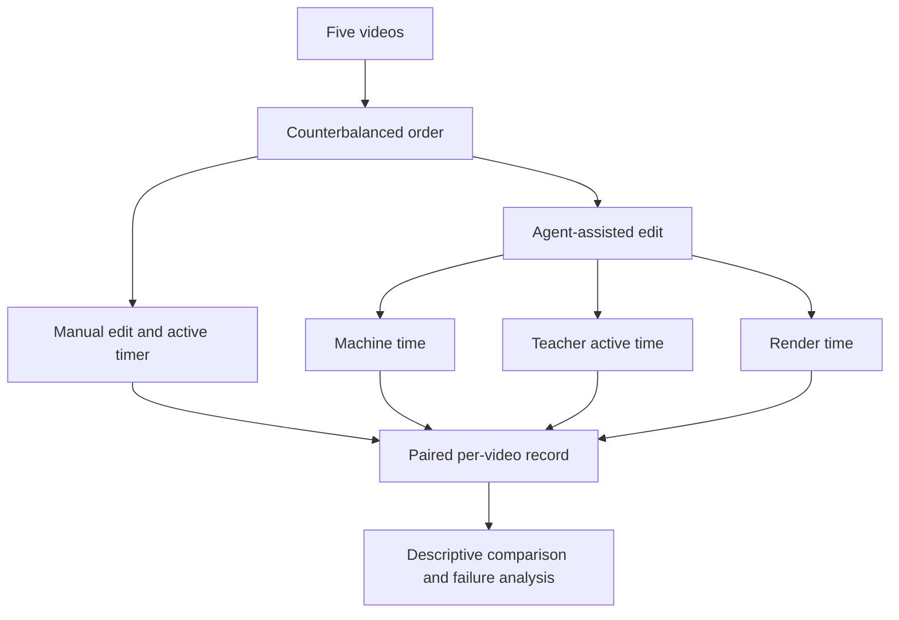
